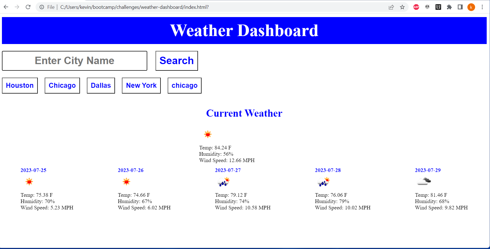

# weather-dashboard
## Description
### I created a Weather Dashboard. When you put a city into the search bar it will store that city in local storage and creat a button for the 5 most recent searches. The website will then  display the current weather and a 5 day forcase for that city. The five day forcast pulls the noon time from the 5 day 3 hour openweatherapi. 
## Links
###
[Website]https://kdonnelly33.github.io/weather-dashboard/
[Repository]https://github.com/KDonnelly33/weather-dashboard
## ScreenShot
###
